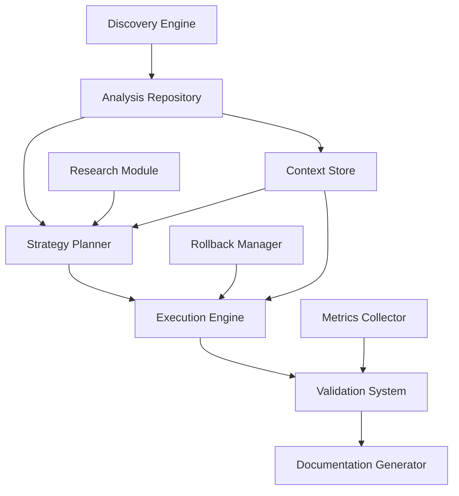
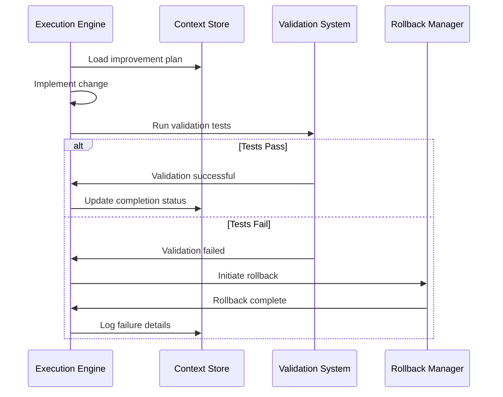

# Design Document: Codebase Improvement Initiative

## Overview

This design document outlines the architecture and implementation approach for a systematic codebase improvement initiative for SpendThrone, a production Solana-based USDC deposit competition platform. The system will analyze, plan, and execute incremental improvements while maintaining 100% functionality preservation and minimizing operational disruption.

### Design Principles

1. **Stability First**: All changes must preserve existing functionality
2. **Incremental Evolution**: Small, isolated improvements with independent validation
3. **Evidence-Based**: Decisions driven by measurements and actual impact
4. **Context-Aware**: Respect existing patterns and team familiarity
5. **Measurable Results**: Track tangible improvements with before/after metrics

### Current System Context

**Technology Stack:**
- Frontend: React 18.2.0, TypeScript 5.9.2, Vite 7.1.7
- State Management: Zustand 5.0.8 (migrating to unified store pattern)
- Blockchain: Solana Web3.js 1.98.4, Wallet Adapter ecosystem
- Backend: Supabase 2.58.0 with PostgreSQL
- UI: Radix UI, Tailwind CSS 4.1.13, Framer Motion 11.0.0
- Testing: Jest 30.2.0, Testing Library 16.3.0

**Existing Documentation:**
- IMPROVEMENT_STRATEGY.md: Priority matrix and enhancement roadmap
- DUPLICATE_CODE_CATALOG.md: Identified code duplication
- CONSOLIDATION_REPORT.md: Store consolidation status
- ZUSTAND_MIGRATION_PLAN.md: State management migration plan

## Architecture

### System Components



### Component Descriptions

#### 1. Discovery Engine
**Purpose**: Systematically analyze codebase structure, patterns, and technical debt

**Responsibilities:**
- Directory structure analysis and module mapping
- Component dependency graph generation
- Pattern recognition and documentation
- Technical debt identification and categorization
- Implicit constraint discovery

**Inputs:**
- Codebase file system
- Package.json dependencies
- Import/export statements
- Existing documentation

**Outputs:**
- Structure analysis report
- Dependency graph (JSON/Mermaid)
- Pattern catalog
- Technical debt inventory with severity ratings

#### 2. Analysis Repository
**Purpose**: Store and organize discovery findings for strategy formulation

**Data Models:**
```typescript
interface ComponentAnalysis {
  path: string;
  type: 'component' | 'service' | 'utility' | 'hook' | 'store';
  dependencies: string[];
  dependents: string[];
  complexity: number;
  testCoverage: number;
  lastModified: Date;
}

interface TechnicalDebt {
  id: string;
  type: 'duplication' | 'complexity' | 'outdated-pattern' | 'missing-tests' | 'security';
  severity: 'critical' | 'high' | 'medium' | 'low';
  location: string[];
  impact: string;
  effort: 'low' | 'medium' | 'high';
}

interface ArchitecturalPattern {
  name: string;
  description: string;
  locations: string[];
  consistency: number; // 0-100%
  bestPracticeAlignment: number; // 0-100%
}
```


#### 3. Research Module
**Purpose**: Gather best practices and solutions for identified improvement opportunities

**Research Areas:**
- React 18+ performance optimization patterns (useMemo, useCallback, React Compiler)
- Zustand 5.x best practices for state management
- Solana Web3 security patterns
- Vite 7 build optimization techniques
- TypeScript 5.9 type safety improvements
- Testing strategies for blockchain applications

**Research Sources:**
- Official documentation (React.dev, Zustand docs)
- Community best practices (GitHub, Stack Overflow)
- Security advisories (npm audit, Snyk)
- Performance benchmarks

**Output Format:**
```typescript
interface ResearchFinding {
  topic: string;
  recommendation: string;
  source: string;
  applicability: 'high' | 'medium' | 'low';
  tradeoffs: string[];
  implementationComplexity: 'low' | 'medium' | 'high';
}
```

#### 4. Strategy Planner
**Purpose**: Formulate prioritized improvement plan based on analysis and research

**Planning Algorithm:**
1. Load technical debt inventory from Analysis Repository
2. Fetch research findings for each debt item
3. Calculate priority score: `(Impact × 10) / (Risk × Effort)`
4. Group improvements by priority tier (P1-P5)
5. Sequence improvements to minimize dependencies
6. Generate implementation roadmap

**Priority Tiers:**
- **P1 Critical**: Build errors, security vulnerabilities, production bugs
- **P2 Safe Redundancy**: Low-risk code duplication removal
- **P3 High-Impact Refactoring**: Frequently modified code areas
- **P4 Performance**: User-facing bottlenecks
- **P5 Developer Experience**: Tooling and workflow improvements

**Output:**
```typescript
interface ImprovementPlan {
  id: string;
  priority: 1 | 2 | 3 | 4 | 5;
  category: 'security' | 'refactoring' | 'deduplication' | 'performance' | 'testing' | 'documentation';
  description: string;
  rationale: string;
  expectedBenefit: string;
  estimatedEffort: string;
  dependencies: string[];
  validationCriteria: string[];
  rollbackProcedure: string;
}
```

#### 5. Execution Engine
**Purpose**: Implement improvements incrementally with continuous validation

**Execution Workflow:**


**Implementation Strategies:**

**Refactoring:**
- Extract complex functions into smaller units
- Rename unclear identifiers
- Simplify conditional logic
- Preserve exact behavior through test validation

**Deduplication:**
- Identify duplicate code blocks (>10 lines, >80% similarity)
- Extract to shared utilities or components
- Update all call sites atomically
- Validate functionality preservation

**Performance Optimization:**
- Profile current performance with React DevTools
- Implement optimizations (memoization, code splitting, lazy loading)
- Measure improvement with before/after metrics
- Ensure no functionality regression

**Security Hardening:**
- Remove hardcoded secrets
- Sanitize user inputs
- Replace innerHTML with safe alternatives
- Implement CSP headers


#### 6. Validation System
**Purpose**: Ensure all changes preserve functionality and meet quality standards

**Validation Layers:**

1. **Static Analysis**
   - TypeScript compilation (tsc --noEmit)
   - ESLint rule compliance
   - Dependency vulnerability scanning (npm audit)

2. **Automated Testing**
   - Unit tests (Jest): 80% coverage for business logic
   - Integration tests: Critical path validation
   - Component tests: UI behavior verification

3. **Build Validation**
   - Successful Vite build completion
   - Bundle size comparison (alert if >15% increase)
   - Build time measurement

4. **Performance Validation**
   - Lighthouse score comparison
   - React DevTools profiler metrics
   - Network request analysis

**Validation Criteria:**
```typescript
interface ValidationResult {
  passed: boolean;
  checks: {
    compilation: boolean;
    linting: boolean;
    unitTests: { passed: number; failed: number; coverage: number };
    integrationTests: { passed: number; failed: number };
    buildSuccess: boolean;
    bundleSize: { current: number; previous: number; change: number };
    performanceScore: { current: number; previous: number; change: number };
  };
  failures: string[];
  warnings: string[];
}
```

#### 7. Rollback Manager
**Purpose**: Provide safe recovery mechanism for failed improvements

**Rollback Strategy:**
- Git-based version control for all changes
- Atomic commits per improvement
- Automated rollback on validation failure
- Manual rollback capability for production issues

**Rollback Procedure:**
```typescript
interface RollbackProcedure {
  improvementId: string;
  commitHash: string;
  affectedFiles: string[];
  rollbackCommand: string;
  validationSteps: string[];
  estimatedDowntime: string;
}
```

#### 8. Documentation Generator
**Purpose**: Maintain comprehensive documentation of improvements and decisions

**Documentation Types:**

1. **Implementation Log**
   - Timestamp and improvement ID
   - Changes made with file paths
   - Validation results
   - Performance metrics

2. **Decision Records**
   - Problem statement
   - Considered alternatives
   - Chosen solution with rationale
   - Expected outcomes

3. **Architecture Documentation**
   - Component relationship diagrams
   - Data flow visualizations
   - Pattern usage documentation

## Components and Interfaces

### Discovery Engine Interface

```typescript
interface IDiscoveryEngine {
  analyzeStructure(): Promise<StructureAnalysis>;
  mapDependencies(): Promise<DependencyGraph>;
  identifyPatterns(): Promise<ArchitecturalPattern[]>;
  catalogTechnicalDebt(): Promise<TechnicalDebt[]>;
  documentConstraints(): Promise<Constraint[]>;
}

interface StructureAnalysis {
  directories: DirectoryNode[];
  modules: ModuleInfo[];
  totalFiles: number;
  totalLines: number;
  languageBreakdown: Record<string, number>;
}

interface DependencyGraph {
  nodes: ComponentNode[];
  edges: DependencyEdge[];
  circularDependencies: string[][];
  orphanedModules: string[];
}
```

### Strategy Planner Interface

```typescript
interface IStrategyPlanner {
  formulateStrategy(
    analysis: StructureAnalysis,
    technicalDebt: TechnicalDebt[],
    research: ResearchFinding[]
  ): Promise<ImprovementPlan[]>;
  
  prioritizeImprovements(plans: ImprovementPlan[]): ImprovementPlan[];
  sequenceExecution(plans: ImprovementPlan[]): ExecutionSequence;
  estimateImpact(plan: ImprovementPlan): ImpactEstimate;
}

interface ExecutionSequence {
  phases: ExecutionPhase[];
  totalEstimatedTime: string;
  criticalPath: string[];
}

interface ExecutionPhase {
  name: string;
  improvements: ImprovementPlan[];
  dependencies: string[];
  estimatedDuration: string;
}
```


### Execution Engine Interface

```typescript
interface IExecutionEngine {
  executeImprovement(plan: ImprovementPlan): Promise<ExecutionResult>;
  trackProgress(improvementId: string): Promise<ProgressStatus>;
  validateChange(improvementId: string): Promise<ValidationResult>;
  rollbackChange(improvementId: string): Promise<RollbackResult>;
}

interface ExecutionResult {
  improvementId: string;
  status: 'success' | 'failed' | 'rolled-back';
  filesModified: string[];
  linesChanged: { added: number; removed: number; modified: number };
  validationResult: ValidationResult;
  duration: number;
  metrics: PerformanceMetrics;
}

interface PerformanceMetrics {
  bundleSizeBefore: number;
  bundleSizeAfter: number;
  buildTimeBefore: number;
  buildTimeAfter: number;
  testCoverageBefore: number;
  testCoverageAfter: number;
}
```

## Data Models

### Core Data Structures

```typescript
// Component Analysis
interface ComponentNode {
  id: string;
  path: string;
  name: string;
  type: ComponentType;
  exports: string[];
  imports: ImportInfo[];
  complexity: ComplexityMetrics;
  testCoverage: number;
  lastModified: Date;
  changeFrequency: number; // commits per month
}

type ComponentType = 
  | 'react-component'
  | 'react-hook'
  | 'service'
  | 'utility'
  | 'store'
  | 'type-definition'
  | 'configuration';

interface ComplexityMetrics {
  cyclomaticComplexity: number;
  cognitiveComplexity: number;
  linesOfCode: number;
  numberOfFunctions: number;
  maxNestingDepth: number;
}

// Technical Debt
interface TechnicalDebtItem extends TechnicalDebt {
  detectedDate: Date;
  estimatedFixTime: number; // hours
  businessImpact: string;
  technicalImpact: string;
  affectedComponents: string[];
  relatedIssues: string[];
}

// Improvement Tracking
interface ImprovementExecution {
  plan: ImprovementPlan;
  startTime: Date;
  endTime?: Date;
  status: ExecutionStatus;
  commits: GitCommit[];
  validations: ValidationResult[];
  metrics: PerformanceMetrics;
  notes: string[];
}

type ExecutionStatus = 
  | 'pending'
  | 'in-progress'
  | 'validating'
  | 'completed'
  | 'failed'
  | 'rolled-back';

interface GitCommit {
  hash: string;
  message: string;
  timestamp: Date;
  filesChanged: string[];
  author: string;
}
```

## Error Handling

### Error Categories and Responses

```typescript
enum ErrorCategory {
  DISCOVERY_FAILURE = 'discovery-failure',
  ANALYSIS_ERROR = 'analysis-error',
  VALIDATION_FAILURE = 'validation-failure',
  BUILD_ERROR = 'build-error',
  TEST_FAILURE = 'test-failure',
  ROLLBACK_FAILURE = 'rollback-failure',
  DEPENDENCY_CONFLICT = 'dependency-conflict'
}

interface ErrorHandler {
  category: ErrorCategory;
  severity: 'critical' | 'high' | 'medium' | 'low';
  recoveryStrategy: RecoveryStrategy;
  notificationRequired: boolean;
}

type RecoveryStrategy = 
  | 'automatic-rollback'
  | 'manual-intervention'
  | 'skip-and-continue'
  | 'halt-execution';
```

### Error Handling Strategies

**Discovery Failures:**
- Log error details with file path and stack trace
- Continue with partial analysis
- Flag affected areas for manual review

**Validation Failures:**
- Automatic rollback to previous state
- Detailed failure report generation
- Block further improvements until resolved

**Build Errors:**
- Immediate rollback
- Critical alert to development team
- Halt all further improvements

**Test Failures:**
- Analyze failure type (regression vs. test update needed)
- Rollback if regression detected
- Update tests if functionality intentionally changed

**Dependency Conflicts:**
- Document conflict details
- Research compatible versions
- Propose resolution strategy
- Require manual approval before proceeding


## Testing Strategy

### Test Pyramid Approach

```
         /\
        /  \  E2E Tests (10%)
       /____\  - Critical user flows
      /      \  - Wallet connection
     /        \ - Deposit submission
    /__________\ Integration Tests (30%)
   /            \ - Component integration
  /              \ - Service layer
 /________________\ Unit Tests (60%)
                    - Business logic
                    - Utilities
                    - Hooks
```

### Testing Levels

#### 1. Unit Tests (60% of test suite)
**Focus**: Individual functions, utilities, hooks

**Coverage Targets:**
- Business logic: 90%
- Utilities: 85%
- Custom hooks: 80%
- Services: 85%

**Tools**: Jest, Testing Library

**Example Test Structure:**
```typescript
describe('depositService', () => {
  describe('validateDeposit', () => {
    it('should accept valid USDC deposit', () => {
      const result = validateDeposit({ amount: 100, token: 'USDC' });
      expect(result.valid).toBe(true);
    });
    
    it('should reject negative amounts', () => {
      const result = validateDeposit({ amount: -10, token: 'USDC' });
      expect(result.valid).toBe(false);
      expect(result.error).toBe('Amount must be positive');
    });
  });
});
```

#### 2. Integration Tests (30% of test suite)
**Focus**: Component interactions, service integration

**Coverage Targets:**
- Critical paths: 100%
- Component integration: 70%
- API integration: 80%

**Test Scenarios:**
- Wallet connection flow
- Deposit submission with validation
- Leaderboard data fetching and display
- State management integration

#### 3. E2E Tests (10% of test suite)
**Focus**: Complete user workflows

**Critical Flows:**
- User connects wallet → views leaderboard → submits deposit → sees confirmation
- User views transaction history
- Admin views dashboard metrics

### Validation Test Suite

**Pre-Improvement Baseline:**
```bash
npm run test:run                    # Capture baseline test results
npm run test:coverage               # Capture baseline coverage
npm run build                       # Capture baseline build metrics
```

**Post-Improvement Validation:**
```bash
npm run test:run                    # Must match or exceed baseline pass rate
npm run test:coverage               # Must maintain or improve coverage
npm run build                       # Must complete successfully
npm run lint                        # Must pass with 0 errors
```

**Regression Detection:**
- Compare test results before/after
- Flag any new test failures
- Require 100% pass rate before proceeding

### Performance Testing

**Metrics to Track:**
- Initial page load time
- Time to interactive (TTI)
- First contentful paint (FCP)
- Largest contentful paint (LCP)
- Bundle size (main chunk, vendor chunk)
- Memory usage during typical operations

**Performance Benchmarks:**
```typescript
interface PerformanceBenchmark {
  metric: string;
  baseline: number;
  target: number;
  threshold: number; // Maximum acceptable regression
}

const benchmarks: PerformanceBenchmark[] = [
  { metric: 'LCP', baseline: 2.5, target: 2.0, threshold: 3.0 },
  { metric: 'FCP', baseline: 1.8, target: 1.5, threshold: 2.5 },
  { metric: 'TTI', baseline: 3.5, target: 3.0, threshold: 4.0 },
  { metric: 'Bundle Size', baseline: 500, target: 425, threshold: 575 }
];
```

## Implementation Phases

### Phase 1: Discovery and Analysis (Week 1)

**Activities:**
1. Run structure analysis on entire codebase
2. Generate dependency graph
3. Identify and catalog technical debt
4. Document existing patterns and constraints
5. Review existing improvement documentation

**Deliverables:**
- Structure analysis report
- Dependency graph visualization
- Technical debt inventory (prioritized)
- Pattern catalog
- Constraint documentation

**Success Criteria:**
- Complete codebase scan (100% of files)
- Dependency graph with <5% missing edges
- Technical debt items categorized by severity
- All existing patterns documented

### Phase 2: Research and Strategy (Week 1-2)

**Activities:**
1. Research best practices for identified issues
2. Evaluate applicability to SpendThrone context
3. Formulate improvement strategy
4. Prioritize improvements using impact/effort matrix
5. Create execution sequence

**Deliverables:**
- Research findings document
- Prioritized improvement plan
- Execution roadmap with timeline
- Risk assessment for each improvement

**Success Criteria:**
- All P1 critical issues identified
- Improvements sequenced to minimize dependencies
- Each improvement has clear validation criteria
- Rollback procedures documented

### Phase 3: Critical Issues (Week 2-3)

**Focus**: P1 - Security vulnerabilities, build errors, production bugs

**Activities:**
1. Remove hardcoded secrets
2. Fix SQL injection vulnerabilities
3. Replace unsafe innerHTML usage
4. Resolve any build errors
5. Fix production-breaking bugs

**Validation:**
- Security audit passes
- Build completes successfully
- All tests pass
- No production errors

### Phase 4: Safe Redundancy Removal (Week 3-4)

**Focus**: P2 - Low-risk code duplication

**Activities:**
1. Extract duplicate utility functions
2. Consolidate similar components
3. Remove unused code
4. Simplify redundant logic

**Validation:**
- Test coverage maintained or improved
- Bundle size reduced
- No functionality regression


### Phase 5: High-Impact Refactoring (Week 4-6)

**Focus**: P3 - Frequently modified code areas

**Activities:**
1. Complete Zustand store migration
2. Refactor complex components (>200 lines)
3. Improve naming consistency
4. Simplify conditional logic
5. Extract reusable patterns

**Validation:**
- Code complexity metrics improved
- Test coverage increased
- Developer feedback positive
- Change velocity maintained or improved

### Phase 6: Performance Optimization (Week 6-7)

**Focus**: P4 - User-facing bottlenecks

**Activities:**
1. Implement React memoization where beneficial
2. Optimize bundle splitting
3. Lazy load non-critical components
4. Optimize Solana transaction handling
5. Reduce unnecessary re-renders

**Validation:**
- Lighthouse score improved by 10+ points
- LCP reduced by 20%
- Bundle size reduced by 15%
- User-reported performance issues resolved

### Phase 7: Developer Experience (Week 7-8)

**Focus**: P5 - Tooling and workflow improvements

**Activities:**
1. Enhance test utilities
2. Improve error messages
3. Add development documentation
4. Optimize build configuration
5. Enhance debugging capabilities

**Validation:**
- Build time reduced
- Developer satisfaction survey
- Onboarding time reduced
- Bug resolution time improved

## Monitoring and Metrics

### Key Performance Indicators (KPIs)

```typescript
interface ProjectKPIs {
  codeQuality: {
    technicalDebtReduction: number; // percentage
    codeComplexityImprovement: number; // average cyclomatic complexity
    duplicationReduction: number; // percentage
    testCoverageIncrease: number; // percentage points
  };
  
  performance: {
    bundleSizeReduction: number; // KB
    buildTimeImprovement: number; // seconds
    lighthouseScoreIncrease: number; // points
    lcpImprovement: number; // milliseconds
  };
  
  stability: {
    testPassRate: number; // percentage
    productionErrorRate: number; // errors per day
    deploymentSuccessRate: number; // percentage
    rollbackCount: number;
  };
  
  productivity: {
    changeVelocity: number; // commits per week
    bugResolutionTime: number; // hours
    featureDeliveryTime: number; // days
    developerSatisfaction: number; // 1-10 scale
  };
}
```

### Continuous Monitoring

**Automated Checks:**
- Daily: Dependency vulnerability scan
- Per commit: Linting, type checking, unit tests
- Per PR: Integration tests, build validation, bundle size check
- Weekly: Full test suite, performance benchmarks, code quality metrics

**Alerting Thresholds:**
- Test pass rate drops below 95%
- Bundle size increases by >10%
- Build time increases by >20%
- New security vulnerabilities detected
- Production error rate increases by >50%

## Risk Management

### Identified Risks and Mitigation

| Risk | Probability | Impact | Mitigation Strategy |
|------|-------------|--------|---------------------|
| Breaking production functionality | Medium | Critical | Comprehensive testing, gradual rollout, quick rollback |
| Dependency conflicts | High | High | Version pinning, thorough testing, compatibility research |
| Performance regression | Medium | High | Performance benchmarking, profiling, gradual optimization |
| Team resistance to changes | Low | Medium | Clear communication, documentation, training |
| Scope creep | Medium | Medium | Strict prioritization, phase-based approach |
| Time overruns | Medium | Low | Buffer time, flexible scope, continuous progress tracking |

### Rollback Procedures

**Immediate Rollback Triggers:**
- Production errors increase by >100%
- Critical functionality broken
- Security vulnerability introduced
- Build failures in production

**Rollback Process:**
1. Identify problematic commit(s)
2. Execute git revert or git reset
3. Run validation test suite
4. Deploy to production
5. Verify functionality restored
6. Document incident and root cause

**Rollback SLA:**
- Detection to rollback decision: <15 minutes
- Rollback execution: <5 minutes
- Validation and deployment: <10 minutes
- Total recovery time: <30 minutes

## Success Criteria

### Phase Completion Criteria

**Discovery Phase:**
- ✅ 100% of codebase analyzed
- ✅ Dependency graph generated
- ✅ Technical debt catalog complete
- ✅ Patterns documented

**Strategy Phase:**
- ✅ Improvement plan prioritized
- ✅ Execution sequence defined
- ✅ Risk assessment complete
- ✅ Validation criteria established

**Execution Phases:**
- ✅ All planned improvements implemented
- ✅ 100% test pass rate maintained
- ✅ No production incidents
- ✅ Performance targets met
- ✅ Documentation updated

### Overall Project Success

**Must Have:**
- Zero production-breaking changes
- All P1 critical issues resolved
- Test coverage ≥80% for business logic
- Build time <3 minutes
- All security vulnerabilities addressed

**Should Have:**
- Code duplication reduced by 40%
- Bundle size reduced by 15%
- Lighthouse score improved by 10 points
- Developer satisfaction score ≥8/10

**Nice to Have:**
- Test coverage ≥90%
- Zero technical debt items rated "high" or "critical"
- Build time <2 minutes
- All P2-P5 improvements completed

## Appendix

### Tools and Technologies

**Analysis Tools:**
- TypeScript Compiler API (structure analysis)
- ESLint (code quality)
- Madge (dependency analysis)
- SonarQube (code complexity)
- npm audit (security vulnerabilities)

**Testing Tools:**
- Jest (unit testing)
- React Testing Library (component testing)
- Playwright (E2E testing)
- Lighthouse (performance testing)

**Build Tools:**
- Vite (bundling)
- TypeScript (compilation)
- Rollup (code splitting)

**Monitoring Tools:**
- React DevTools Profiler
- Chrome DevTools Performance
- Bundle Analyzer
- Sentry (error tracking)

### References

- React 18 Documentation: https://react.dev
- Zustand Documentation: https://zustand.docs.pmnd.rs
- Solana Web3.js Documentation: https://solana-labs.github.io/solana-web3.js
- Vite Documentation: https://vitejs.dev
- TypeScript Handbook: https://www.typescriptlang.org/docs
- EARS Requirements Pattern: https://alistairmavin.com/ears
- INCOSE Requirements Quality: https://www.incose.org

### Glossary

See requirements.md for complete glossary of terms.
