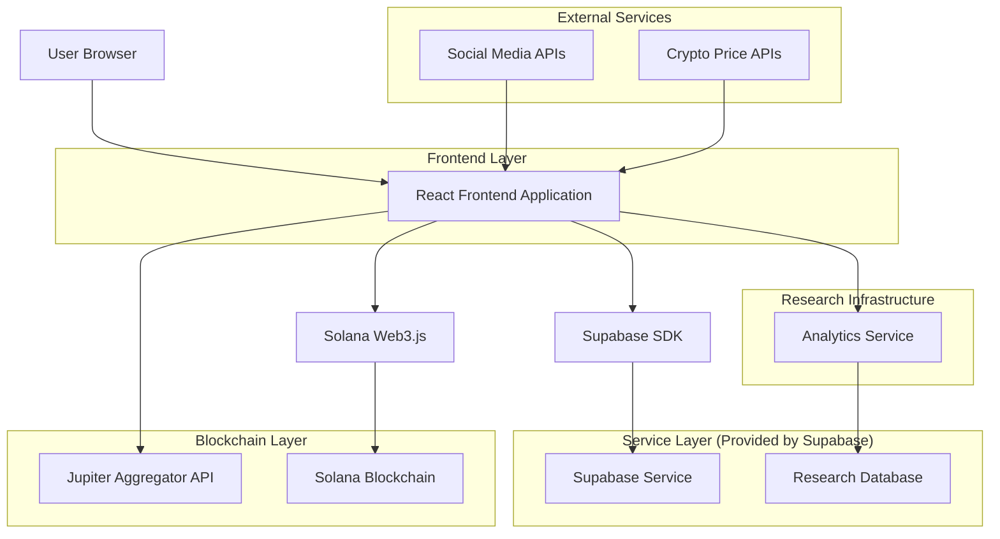
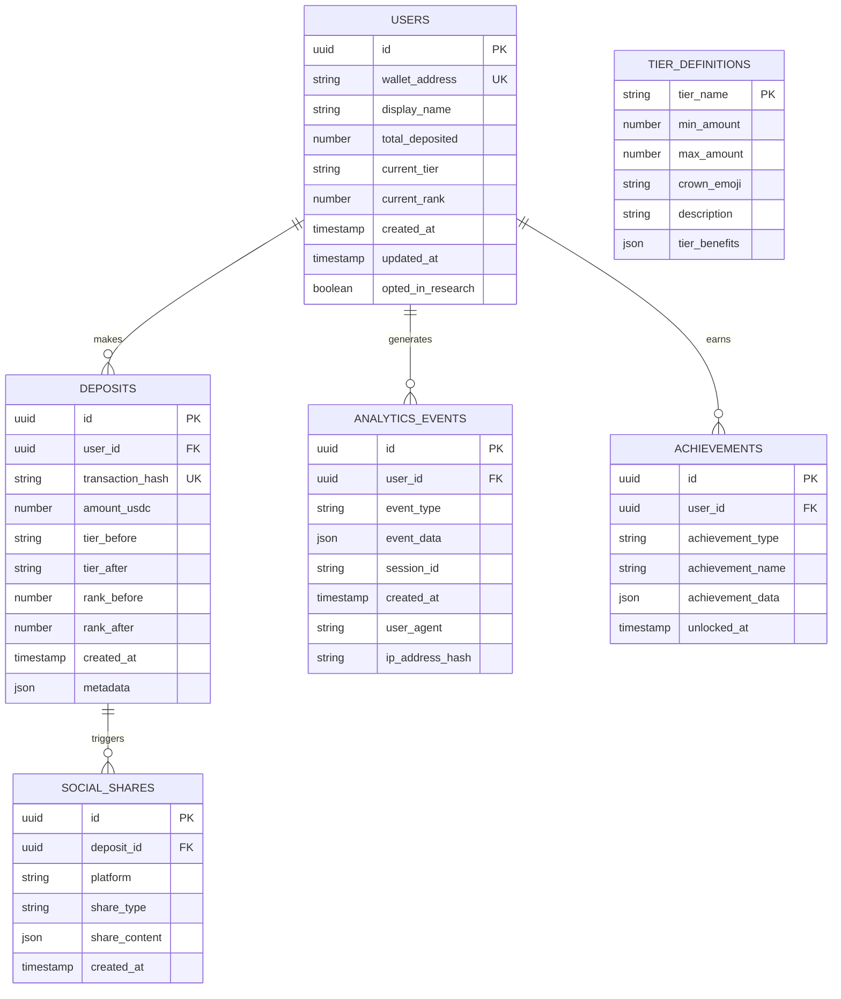

# SpendThrone Technical Architecture Document

## 1. Architecture Design



## 2. Technology Description

- Frontend: React@18 + TypeScript + TailwindCSS@3 + Vite + shadcn/ui
- Backend: Supabase (Authentication, Database, Real-time subscriptions)
- Blockchain: Solana Web3.js + Jupiter Aggregator SDK
- Analytics: Custom behavioral tracking with Supabase integration
- Social: Twitter API v2 + Discord/Telegram webhooks
- State Management: Zustand for client state
- Animations: Framer Motion for crown animations and status transitions

## 3. Route Definitions

| Route | Purpose |
|-------|----------|
| / | Landing page with degen hero section and satirical messaging |
| /throne | Main leaderboard displaying royal degen tier rankings |
| /deposit | USDC deposit interface with Jupiter integration |
| /history | Status symbol evolution timeline with research citations |
| /profile/:wallet | Individual user profile with deposit history and achievements |
| /research | Live research dashboard showing behavioral analytics |
| /about | Platform explanation with academic research background |
| /terms | Legal disclaimers emphasizing permanent fund loss |
| /privacy | Data collection transparency for research purposes |

## 4. API Definitions

### 4.1 Core API Endpoints

**User Authentication & Profile**
```
POST /api/auth/wallet-connect
```
Request:
| Param Name | Param Type | isRequired | Description |
|------------|------------|------------|--------------|
| wallet_address | string | true | Solana wallet public key |
| signature | string | true | Signed message for verification |

Response:
| Param Name | Param Type | Description |
|------------|------------|-------------|
| user_id | uuid | Unique user identifier |
| tier | string | Current royal degen tier |
| total_deposited | number | Total USDC deposited |
| rank | number | Current leaderboard position |

**Deposit Tracking**
```
POST /api/deposits/record
```
Request:
| Param Name | Param Type | isRequired | Description |
|------------|------------|------------|--------------|
| transaction_hash | string | true | Solana transaction signature |
| amount | number | true | USDC amount deposited |
| user_id | uuid | true | User identifier |

Response:
| Param Name | Param Type | Description |
|------------|------------|-------------|
| new_rank | number | Updated leaderboard position |
| tier_change | boolean | Whether user moved to new tier |
| achievement_unlocked | string[] | New achievements earned |

**Research Analytics**
```
POST /api/analytics/track-behavior
```
Request:
| Param Name | Param Type | isRequired | Description |
|------------|------------|------------|--------------|
| event_type | string | true | Type of user behavior |
| user_id | uuid | false | User identifier (anonymous if not provided) |
| metadata | object | true | Event-specific data |

Response:
| Param Name | Param Type | Description |
|------------|------------|-------------|
| tracked | boolean | Whether event was successfully recorded |

**Leaderboard Data**
```
GET /api/leaderboard
```
Query Parameters:
| Param Name | Param Type | isRequired | Description |
|------------|------------|------------|--------------|
| limit | number | false | Number of entries to return (default: 100) |
| offset | number | false | Pagination offset |

Response:
| Param Name | Param Type | Description |
|------------|------------|-------------|
| users | array | Leaderboard entries with rank, wallet, amount, tier |
| total_count | number | Total number of users |
| total_deposited | number | Total USDC across all users |

## 5. Data Model

### 5.1 Data Model Definition



### 5.2 Data Definition Language

**Users Table**
```sql
-- Create users table
CREATE TABLE users (
    id UUID PRIMARY KEY DEFAULT gen_random_uuid(),
    wallet_address VARCHAR(44) UNIQUE NOT NULL,
    display_name VARCHAR(100),
    total_deposited DECIMAL(18,6) DEFAULT 0,
    current_tier VARCHAR(50) DEFAULT 'Broke Peasant Degens',
    current_rank INTEGER DEFAULT 0,
    created_at TIMESTAMP WITH TIME ZONE DEFAULT NOW(),
    updated_at TIMESTAMP WITH TIME ZONE DEFAULT NOW(),
    opted_in_research BOOLEAN DEFAULT true
);

-- Create indexes
CREATE INDEX idx_users_wallet_address ON users(wallet_address);
CREATE INDEX idx_users_total_deposited ON users(total_deposited DESC);
CREATE INDEX idx_users_current_rank ON users(current_rank);

-- Row Level Security
ALTER TABLE users ENABLE ROW LEVEL SECURITY;

-- Grant permissions
GRANT SELECT ON users TO anon;
GRANT ALL PRIVILEGES ON users TO authenticated;
```

**Deposits Table**
```sql
-- Create deposits table
CREATE TABLE deposits (
    id UUID PRIMARY KEY DEFAULT gen_random_uuid(),
    user_id UUID REFERENCES users(id) ON DELETE CASCADE,
    transaction_hash VARCHAR(88) UNIQUE NOT NULL,
    amount_usdc DECIMAL(18,6) NOT NULL,
    tier_before VARCHAR(50),
    tier_after VARCHAR(50),
    rank_before INTEGER,
    rank_after INTEGER,
    created_at TIMESTAMP WITH TIME ZONE DEFAULT NOW(),
    metadata JSONB DEFAULT '{}'
);

-- Create indexes
CREATE INDEX idx_deposits_user_id ON deposits(user_id);
CREATE INDEX idx_deposits_created_at ON deposits(created_at DESC);
CREATE INDEX idx_deposits_amount ON deposits(amount_usdc DESC);
CREATE INDEX idx_deposits_transaction_hash ON deposits(transaction_hash);

-- Row Level Security
ALTER TABLE deposits ENABLE ROW LEVEL SECURITY;

-- Grant permissions
GRANT SELECT ON deposits TO anon;
GRANT ALL PRIVILEGES ON deposits TO authenticated;
```

**Analytics Events Table**
```sql
-- Create analytics_events table
CREATE TABLE analytics_events (
    id UUID PRIMARY KEY DEFAULT gen_random_uuid(),
    user_id UUID REFERENCES users(id) ON DELETE SET NULL,
    event_type VARCHAR(100) NOT NULL,
    event_data JSONB DEFAULT '{}',
    session_id VARCHAR(100),
    created_at TIMESTAMP WITH TIME ZONE DEFAULT NOW(),
    user_agent TEXT,
    ip_address_hash VARCHAR(64)
);

-- Create indexes
CREATE INDEX idx_analytics_events_user_id ON analytics_events(user_id);
CREATE INDEX idx_analytics_events_type ON analytics_events(event_type);
CREATE INDEX idx_analytics_events_created_at ON analytics_events(created_at DESC);
CREATE INDEX idx_analytics_events_session ON analytics_events(session_id);

-- Row Level Security
ALTER TABLE analytics_events ENABLE ROW LEVEL SECURITY;

-- Grant permissions (research data should be protected)
GRANT SELECT ON analytics_events TO authenticated;
GRANT INSERT ON analytics_events TO anon, authenticated;
```

**Achievements Table**
```sql
-- Create achievements table
CREATE TABLE achievements (
    id UUID PRIMARY KEY DEFAULT gen_random_uuid(),
    user_id UUID REFERENCES users(id) ON DELETE CASCADE,
    achievement_type VARCHAR(50) NOT NULL,
    achievement_name VARCHAR(200) NOT NULL,
    achievement_data JSONB DEFAULT '{}',
    unlocked_at TIMESTAMP WITH TIME ZONE DEFAULT NOW()
);

-- Create indexes
CREATE INDEX idx_achievements_user_id ON achievements(user_id);
CREATE INDEX idx_achievements_type ON achievements(achievement_type);
CREATE INDEX idx_achievements_unlocked_at ON achievements(unlocked_at DESC);

-- Row Level Security
ALTER TABLE achievements ENABLE ROW LEVEL SECURITY;

-- Grant permissions
GRANT SELECT ON achievements TO anon;
GRANT ALL PRIVILEGES ON achievements TO authenticated;
```

**Tier Definitions Table**
```sql
-- Create tier_definitions table
CREATE TABLE tier_definitions (
    tier_name VARCHAR(50) PRIMARY KEY,
    min_amount DECIMAL(18,6) NOT NULL,
    max_amount DECIMAL(18,6),
    crown_emoji VARCHAR(10) NOT NULL,
    description TEXT NOT NULL,
    tier_benefits JSONB DEFAULT '{}'
);

-- Insert initial tier data
INSERT INTO tier_definitions (tier_name, min_amount, max_amount, crown_emoji, description, tier_benefits) VALUES
('Broke Peasant Degens', 0, 99.99, '🍜', 'Still eating ramen, ngmi ser', '{"perks": ["Basic flexing rights", "Ramen crown emoji"]}'),
('Degen Nobles Who Made It', 100, 999.99, '💎', 'Finally escaped the fiat mines', '{"perks": ["Diamond hands recognition", "Mid-tier respect"]}'),
('Chad Knight Pumpers', 1000, 9999.99, '⚔️', 'Pumping bags and taking names', '{"perks": ["Sword crown of pumps", "Chad status confirmed"]}'),
('Whale Lord Supremes', 10000, 99999.99, '🐋', 'Moves markets with a single tweet', '{"perks": ["Whale crown dominance", "Market moving power"]}'),
('Gigachad Throne Gods', 100000, NULL, '👑', 'Probably Satoshi''s cousin', '{"perks": ["Ultimate gigachad crown", "Legendary status", "Probably related to Satoshi"]}');

-- Grant permissions
GRANT SELECT ON tier_definitions TO anon, authenticated;
```

**Database Functions for Rank Calculation**
```sql
-- Function to update user ranks after deposit
CREATE OR REPLACE FUNCTION update_user_ranks()
RETURNS TRIGGER AS $$
BEGIN
    -- Update the user's total deposited amount
    UPDATE users 
    SET total_deposited = (
        SELECT COALESCE(SUM(amount_usdc), 0) 
        FROM deposits 
        WHERE user_id = NEW.user_id
    ),
    updated_at = NOW()
    WHERE id = NEW.user_id;
    
    -- Update all user ranks based on total deposited
    WITH ranked_users AS (
        SELECT id, 
               ROW_NUMBER() OVER (ORDER BY total_deposited DESC, created_at ASC) as new_rank
        FROM users 
        WHERE total_deposited > 0
    )
    UPDATE users 
    SET current_rank = ranked_users.new_rank
    FROM ranked_users 
    WHERE users.id = ranked_users.id;
    
    -- Update tiers based on deposit amounts
    UPDATE users 
    SET current_tier = (
        SELECT tier_name 
        FROM tier_definitions 
        WHERE users.total_deposited >= min_amount 
        AND (max_amount IS NULL OR users.total_deposited <= max_amount)
        ORDER BY min_amount DESC 
        LIMIT 1
    )
    WHERE total_deposited > 0;
    
    RETURN NEW;
END;
$$ LANGUAGE plpgsql;

-- Create trigger
CREATE TRIGGER trigger_update_ranks
    AFTER INSERT ON deposits
    FOR EACH ROW
    EXECUTE FUNCTION update_user_ranks();
```

**Real-time Subscriptions Setup**
```sql
-- Enable real-time for leaderboard updates
ALTER PUBLICATION supabase_realtime ADD TABLE users;
ALTER PUBLICATION supabase_realtime ADD TABLE deposits;
ALTER PUBLICATION supabase_realtime ADD TABLE achievements;
```

## 6. Frontend Architecture Patterns

### 6.1 Component Structure

```
src/
├── components/
│   ├── ui/                    # shadcn/ui components
│   ├── degen/                 # Custom degen-themed components
│   │   ├── CrownAnimation.tsx
│   │   ├── DegenButton.tsx
│   │   ├── SatiricalWarning.tsx
│   │   └── TierBadge.tsx
│   ├── leaderboard/
│   │   ├── LeaderboardTable.tsx
│   │   ├── UserRankCard.tsx
│   │   └── TierVisualization.tsx
│   ├── research/
│   │   ├── AnalyticsDashboard.tsx
│   │   ├── BehaviorTracker.tsx
│   │   └── ResearchInsights.tsx
│   └── social/
│       ├── TwitterShareButton.tsx
│       ├── DiscordNotification.tsx
│       └── SocialProofFeed.tsx
├── hooks/
│   ├── useWallet.ts
│   ├── useLeaderboard.ts
│   ├── useDeposit.ts
│   ├── useAnalytics.ts
│   └── useSocialShare.ts
├── stores/
│   ├── walletStore.ts
│   ├── leaderboardStore.ts
│   └── analyticsStore.ts
├── utils/
│   ├── solana.ts
│   ├── jupiter.ts
│   ├── analytics.ts
│   └── satirical-messages.ts
└── types/
    ├── user.ts
    ├── deposit.ts
    ├── analytics.ts
    └── social.ts
```

### 6.2 State Management Strategy

**Zustand Stores:**
- `walletStore`: Wallet connection, user authentication
- `leaderboardStore`: Real-time leaderboard data, rankings
- `analyticsStore`: Behavioral tracking, research data
- `socialStore`: Social sharing, notifications

### 6.3 Real-time Features

**Supabase Real-time Subscriptions:**
- Live leaderboard updates when new deposits occur
- Real-time tier changes and rank movements
- Live social proof notifications
- Achievement unlock animations

## 7. Security & Privacy Considerations

### 7.1 Wallet Security
- Never store private keys or seed phrases
- Use message signing for authentication
- Implement proper CSRF protection
- Rate limiting on deposit endpoints

### 7.2 Research Data Privacy
- Hash IP addresses for analytics
- Anonymize behavioral data
- Provide opt-out mechanisms
- GDPR compliance for EU users
- Clear consent for research participation

### 7.3 Smart Contract Security
- Multi-signature wallet for deposit collection
- Time-locked withdrawals for emergency situations
- Regular security audits
- Transparent fund management

## 8. Performance Optimization

### 8.1 Frontend Optimization
- Code splitting by route
- Lazy loading for heavy components
- Image optimization for crown animations
- Service worker for offline leaderboard caching

### 8.2 Database Optimization
- Proper indexing on frequently queried columns
- Connection pooling for high traffic
- Read replicas for analytics queries
- Caching layer for leaderboard data

### 8.3 Real-time Performance
- Debounced real-time updates
- Selective subscription to relevant data
- Optimistic UI updates for better UX

## 9. Monitoring & Analytics

### 9.1 Application Monitoring
- Error tracking with Sentry
- Performance monitoring
- Uptime monitoring
- Database performance metrics

### 9.2 Research Analytics
- Custom behavioral event tracking
- A/B testing infrastructure
- Conversion funnel analysis
- User journey mapping

### 9.3 Business Metrics
- Total USDC deposited
- User acquisition and retention
- Social sharing rates
- Media coverage tracking

## 10. Deployment & DevOps

### 10.1 Environment Setup
- Development: Local Supabase + Solana devnet
- Staging: Supabase staging + Solana testnet
- Production: Supabase production + Solana mainnet

### 10.2 CI/CD Pipeline
- Automated testing on pull requests
- Database migration validation
- Security scanning
- Automated deployment to Vercel

### 10.3 Backup & Recovery
- Daily database backups
- Point-in-time recovery capability
- Disaster recovery procedures
- Data export capabilities for research

This technical architecture supports SpendThrone's unique position as both an entertaining satirical platform and a serious research tool for studying digital status consumption behaviors in cryptocurrency communities.